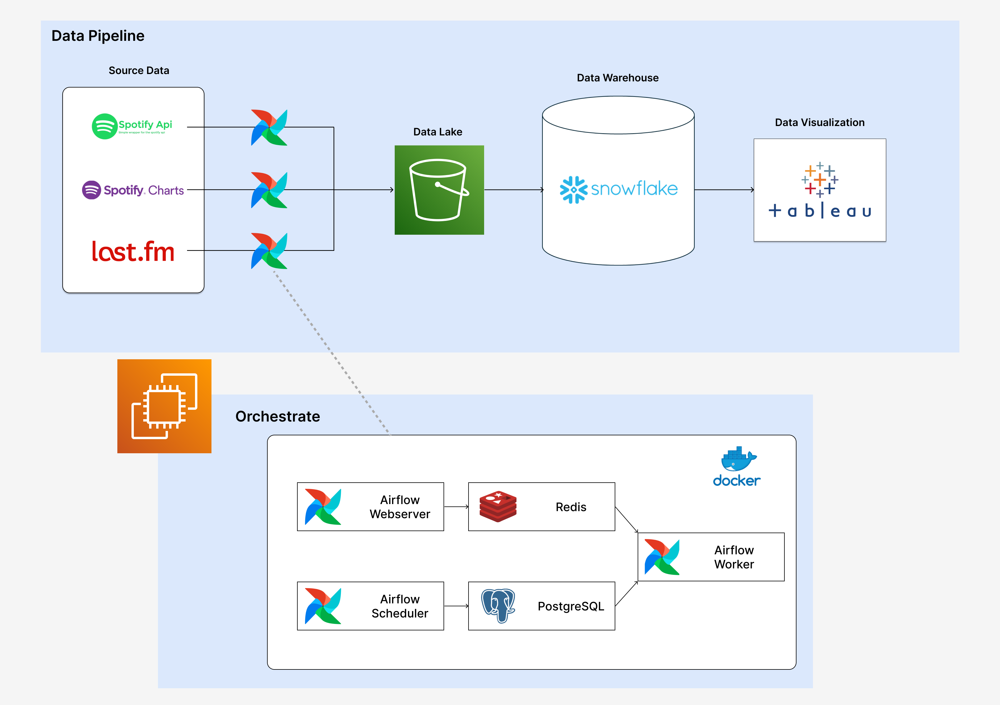
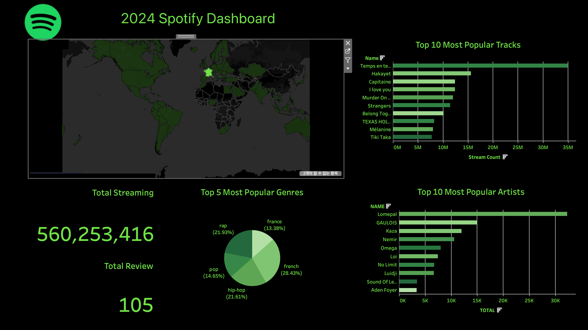

<!-- PROJECT LOGO -->
<br />
  <h1 align="center">Spotify & LAST.FM을 이용한 2024 음악 트랜드</h1>
  <p align="center">
    Tableau를 이용한 2024년 전 세계 음악 트랜드 분석 및 시각화
    <br />
    <br />
    
    
    
    <br />
    
     
  </p>
</div>

<!-- ABOUT THE PROJECT -->
## 📋 About The Project
* **목표** : 데이터 파이프라인을 구축하여 ETL 과정을 자동화하고, 저장된 데이터를 활용하여 데이터 시각화를 수행하는 프로젝트를 수행한다.

### Data Engineering
1. 데이터 수집 및 저장
    * spotify chart, spotify api, last.fm 사이트에서 2024년 발매 음악 데이터를 수집하여 AWS S3에 저장
2. 데이터 변환 및 DB 저장
    * 수집된 데이터 특성을 반영하여 변환시킨 후 AWS S3에 저장한 후 Snowflake에 데이터 적재
3. 워크 플로우 관리 및 자동화
    * 데이터 파이프라인 구축하여 ETL 과정을 Apache Airflow를 이용해 자동화 및 스케줄링
### Data Visualization
1. 데이터 분석 및 시각화
    * Snowflake와 Tableau를 연결시켜 실시간으로 데이터를 업데이트하고 분석하여 대시보드를 생성

## 🔎 프로젝트 구조


## 🗄 디렉토리 구조 <a name='folder'></a>
```Plain Text
├──📁dags
│   └── sql
│       ├── album.py
│       ├── artist.py
│       ├── create_storage_integration.sql
│       ├── create_table_if_not_exists.sql
│       ├── create_table_or_replace.sql
│       ├── information.py
│       ├── review.py
│       ├── review_date.py
│       ├── tag.py
│       ├── track.py
│       ├── track_artist.py
│       ├── track_chart.py
│       ├── url.py
│    └── utils
│        ├── common_util.py
│        ├── constan_util.py
│ 
│    ├── delete_dirs_dag.py
│    ├── delete_xcom.py
│    ├── last_fm_dag.py
│    ├── setting_date_dag.py
│    ├── spotify_api_dag.py
│    ├── spotify_charts_dag.py
│    ├── transform_last_fm_dag.py
│    ├── transform_spotify_dag.py
│    ├── upload_last_fm_to_snowflake_dag.py
│    ├── upload_spotify_to_snowflake_dag.py
│
├──📁downloads
│    └── last_fm
│        ├── information
│        ├── tags
│        ├── reviews
│    └── spotify
│        └── api
│            ├── albums
│            ├── artists
│            ├── tracks
│        └── chart
├──📁transfrom
│    └── last_fm
│        ├── information
│        ├── tags
│        ├── reviews
│    └── spotify
│        ├── albums
│        ├── artists
│        ├── charts
│        ├── track-artists
│        ├── track-charts
│
├── .env
├── requirements.txt
├── .gitignore
├── docker-compose.yaml
├── Dockerfile
├── README.md
├── LICENSE
```

## 🎥 View Demo
<a href="https://youtu.be/jgr4iWDZkvU" target="_blank">
    
</a>
